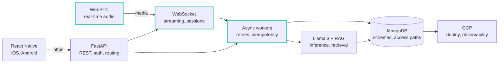
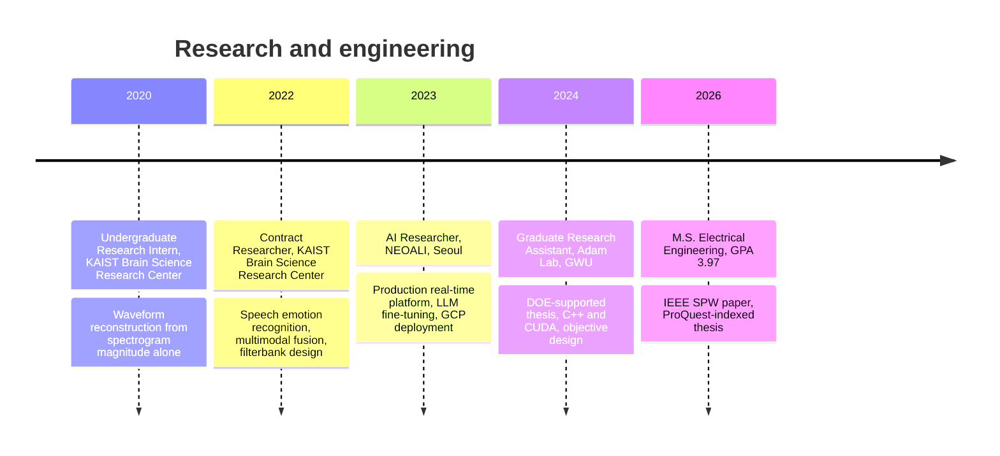

  
  
  
  

I build systems that run in production and the measurements that prove they work.

Most of my work sits where models meet the machinery that has to serve them: a real-time audio platform
that could not drop a session, a simulator whose two execution backends disagreed, an objective function
that had to survive attempts to game it. **M.S. Electrical Engineering, GWU, GPA 3.97.**

---

## A system I owned end to end

At NEOALI I built and operated the backend behind an assistive communication product for people with
severe speech impairments. Audio had to arrive in real time, inference could not block the request path,
and sessions had to degrade rather than drop.

The outlined path is where the interesting failure modes lived: half-open sockets, reconnect storms,
ordering, and making sure a retried call could not double-apply an effect.

---

## Projects

<b>ca3</b> &nbsp; Reduced-scale CA3 spiking network &nbsp; <code>C++</code> <code>CUDA</code> <code>CARLsim</code> <code>Optuna</code>

 

My M.S. thesis, supported by the U.S. Department of Energy, Office of Science.

**The question.** Biological CA3 models are usually built at or near biological scale, which makes them
expensive and impractical for neuromorphic hardware. Does a substantially reduced recurrent circuit
still form cell assemblies and complete patterns from partial cues, or does the function depend on scale?

**Result.** 91% peak reconstruction accuracy. Recall error fell to zero at 75% cue coverage while
separation error stayed stable across cue levels.

**The hard part was not the network, it was deciding what "working" meant.** Every single-number
measure I tried was satisfiable by a degenerate solution. Fire indiscriminately and completion looks
great. Fire almost nothing and separation looks great. Either one gives a good headline number and a
useless model. So the objective has four terms that cannot all be satisfied by collapsing the others:

| Term | Penalizes |
|---|---|
| Completion | Cued assembly failing to fully reactivate |
| Separation | Off-target populations firing alongside the cued one |
| Precision | Spikes outside the intended assembly |
| Recall | Assembly members that never fire |

The system is non-differentiable, so parameters are fit with derivative-free search through an Optuna
study over parallel simulation jobs.

**A bug worth mentioning.** While validating, the GPU and CPU backends produced different conductance
values for identical network configurations. Tracing it through the CARLsim source, the cause was a
loop-placement defect in the CPU conductance decay path: decay applied per incoming spike instead of
once per timestep, so signal collapse scaled with a neuron's in-degree. If you run CARLsim on CPU with
high fan-in and your results do not match GPU, check there.

<a href="https://github.com/ribkatam/ca3">Open repository &rarr;</a>

<b>Pintos-operating-system</b> &nbsp; OS internals from scratch &nbsp; <code>C</code>

 

Core operating system components implemented in C:

- Threading and scheduling, including priority donation
- User program loading, argument passing, and system calls
- Virtual memory with page fault handling and eviction
- File system layer

This is where concurrency stops being a diagram. Race conditions, deadlock, and failure handling at the
level where the abstraction is yours to get wrong.

<a href="https://github.com/ribkatam/Pintos-operating-system">Open repository &rarr;</a>

<b>SER</b> &nbsp; Speech emotion recognition &nbsp; <code>Python</code> <code>PyTorch</code> <code>IEMOCAP</code>

 

Built at KAIST's Brain Science Research Center. Discrete emotion classification combining top-down and
bottom-up attention.

The system was designed around one comparison: **do learned representations from large pretrained
speech models beat hand-designed spectral features, and by how much?** Both paths are implemented and
switchable from config, so the comparison is reproducible rather than anecdotal.

| Path | Features |
|---|---|
| Hand-designed | MFCC, Mel-spectrogram |
| Learned | Pretrained acoustic BERT embeddings, 80-dim Mel with delta |

Every audio, feature, model, and training parameter lives in `param.yaml`. An experiment is fully
described by its config file, not by what someone remembers editing.

Later extended to multimodal recognition by fusing facial-landmark features with the acoustic pipeline.

<a href="https://github.com/ribkatam/SER">Open repository &rarr;</a>

<b>LogFilterBank</b> &nbsp; Pitch shift by index remapping &nbsp; <code>Python</code> <code>NumPy</code>

 

Pitch is perceived logarithmically. On a mel scale the spacing is only approximately logarithmic, so a
constant pitch shift is not a constant index offset, and shifting pitch means going back to the signal.

On a fully logarithmic filterbank, one musical interval is a **constant integer offset in bin index**.
Pitch shifting becomes an array operation on the spectrogram, cheap enough to sit inside a training loop
or a real-time pipeline.

Applied to voice conversion and text-to-speech.

<a href="https://github.com/ribkatam/LogFilterBank">Open repository &rarr;</a>

<b>10-K-filing-RFD-extractor</b> &nbsp; Risk factor extraction &nbsp; <code>Python</code> <code>NLP</code>

 

Extracts risk factor disclosures from SEC 10-K filings for downstream analysis. Filings are long,
inconsistently formatted, and only partly structured, so the extraction has to survive real documents
rather than a clean sample.

<a href="https://github.com/ribkatam/10-K-filing-RFD-extractor">Open repository &rarr;</a>

---

## Where I have been

---

## Publications

<b>Cyberbiosecurity Risk Assessment Framework for Genomic Data Storage in Cloud Environments</b> &nbsp; <code>IEEE SPW 2026</code>

 

A. T. Chufare, R. Tiruneh and S. B. Juja. 2026 IEEE Symposium on Security and Privacy Workshops, May 2026.

Risk assessment and compliance analysis for storing sensitive genomic data in cloud environments, where
the threat model spans both conventional cloud security and the particular sensitivities of biological data.

<b>Pattern Formation and Retrieval in a Reduced-Scale CA3-Inspired Neural Network</b> &nbsp; <code>M.S. Thesis</code>

 

R. Tiruneh. M.S. Thesis, The George Washington University, 2026.
Indexed on ProQuest Dissertations and Theses Global. Advised by Prof. Gina C. Adam.

---

## Tools

<b>What I reach for</b>

 

| | |
|---|---|
| **Languages** | Python, TypeScript, C++, C, CUDA, SQL, JavaScript |
| **Backend** | FastAPI, Node.js, REST design, WebSocket, WebRTC, MongoDB |
| **Distributed** | Retries, idempotency, fault tolerance, async workers, concurrency |
| **Cloud** | GCP, AWS, Docker, CI/CD, Git, Linux |
| **Machine learning** | PyTorch, LLM fine-tuning, RAG, BERT, XGBoost, graph neural networks |
| **Data** | Apache Spark, pandas, NumPy, Optuna, SciPy |

---

Open to backend and machine learning engineering roles &nbsp;/&nbsp;
<a href="https://ribka-portfolio.vercel.app/">ribka-portfolio.vercel.app</a>

